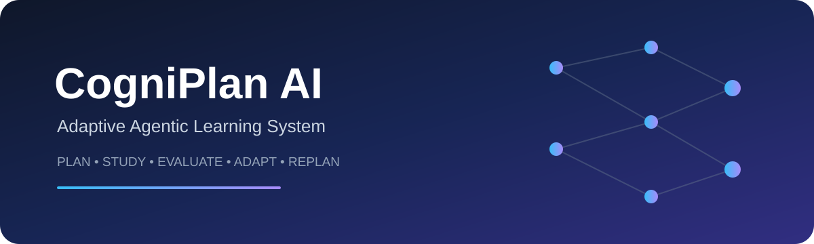

<div align="center">



<br>

# 🧠 CogniPlan AI

### Adaptive Multi-Agent Planning & Decision Intelligence System

**Plan • Evaluate • Adapt • Recover**

<br>


</div>

---

# 🧠 What is CogniPlan AI?

**CogniPlan AI is an adaptive multi-agent planning system designed to transform goals into executable plans, evaluate their progress, detect blockers, and dynamically adapt when circumstances change.**

Traditional planning systems generally assume that the environment remains stable.

Real-world planning does not.

Tasks can become blocked.

Priorities can change.

Resources can become unavailable.

Deadlines can move.

New information can invalidate an earlier decision.

CogniPlan AI is designed around a different principle:

> **A good intelligent system should not only create a plan — it should know when the plan is no longer working and adapt.**

The system therefore separates planning into multiple specialized cognitive components.

```text
                    USER GOAL
                        │
                        ▼
               ┌─────────────────┐
               │  PLANNER AGENT  │
               └────────┬────────┘
                        │
                        ▼
                 INITIAL PLAN
                        │
                        ▼
               ┌─────────────────┐
               │ EVALUATOR AGENT │
               └────────┬────────┘
                        │
              ┌─────────┴─────────┐
              ▼                   ▼
          ON TRACK              BLOCKED
              │                   │
              │                   ▼
              │          ┌─────────────────┐
              │          │ BLOCKER ENGINE  │
              │          └────────┬────────┘
              │                   │
              │                   ▼
              │          ┌─────────────────┐
              │          │ ADAPTIVE AGENT  │
              │          └────────┬────────┘
              │                   │
              └─────────┬─────────┘
                        ▼
                 UPDATED PLAN
                        │
                        ▼
                  NEXT ACTION
```

---

# 🎯 The Problem

Most basic task-planning applications follow a relatively static workflow:

```text
Input Goal
    ↓
Generate Tasks
    ↓
Display Tasks
```

This works only when assumptions remain valid.

Real-world environments introduce uncertainty:

* Tasks become blocked
* Dependencies change
* Resources disappear
* Deadlines shift
* Priorities change
* Estimated effort differs from actual effort
* New constraints appear

A static planner may continue following an outdated plan.

CogniPlan AI introduces an **adaptive planning loop**.

```text
PLAN
 ↓
EXECUTE
 ↓
OBSERVE
 ↓
EVALUATE
 ↓
DETECT BLOCKERS
 ↓
ADAPT
 ↓
REPLAN
 ↓
EXECUTE AGAIN
```

This transforms planning from a one-time generation problem into a **continuous decision-making problem**.

---

# 🏗️ System Architecture

CogniPlan AI follows a modular multi-agent architecture.

Each component has a specific responsibility instead of forcing one model or one function to handle the entire planning process.

```text
                         ┌───────────────────┐
                         │    USER / GOAL    │
                         └─────────┬─────────┘
                                   │
                                   ▼
                         ┌───────────────────┐
                         │   PLANNER AGENT   │
                         │                   │
                         │ Goal Decomposition│
                         │ Task Generation   │
                         │ Dependencies      │
                         └─────────┬─────────┘
                                   │
                                   ▼
                         ┌───────────────────┐
                         │    PLAN STATE     │
                         └─────────┬─────────┘
                                   │
                                   ▼
                         ┌───────────────────┐
                         │  EVALUATOR AGENT  │
                         │                   │
                         │ Progress         │
                         │ Feasibility      │
                         │ Performance      │
                         └─────────┬─────────┘
                                   │
                    ┌──────────────┴──────────────┐
                    │                             │
                    ▼                             ▼
             PLAN HEALTHY                    PLAN DEGRADED
                    │                             │
                    │                             ▼
                    │                    ┌─────────────────┐
                    │                    │ BLOCKER ENGINE  │
                    │                    │                 │
                    │                    │ Detect          │
                    │                    │ Classify        │
                    │                    │ Prioritize      │
                    │                    └────────┬────────┘
                    │                             │
                    │                             ▼
                    │                    ┌─────────────────┐
                    │                    │ ADAPTIVE AGENT  │
                    │                    │                 │
                    │                    │ Reprioritize    │
                    │                    │ Modify plan     │
                    │                    │ Recover         │
                    │                    └────────┬────────┘
                    │                             │
                    └──────────────┬──────────────┘
                                   ▼
                            UPDATED PLAN
                                   │
                                   ▼
                              NEXT ACTION
                                   │
                                   ▼
                             NEW OBSERVATION
                                   │
                                   └──────────────► LOOP
```

---

# 🤖 Multi-Agent Design

The core idea behind CogniPlan AI is **specialization**.

Instead of creating one monolithic planning function, the system separates responsibilities into agents and components.

## 🧩 Planner Agent

The Planner Agent is responsible for transforming a high-level objective into smaller executable components.

### Responsibilities

* Understand the goal
* Decompose objectives
* Generate tasks
* Establish task order
* Identify dependencies
* Construct an initial plan

Conceptually:

```text
High-Level Goal
      ↓
Goal Decomposition
      ↓
Sub-Goals
      ↓
Tasks
      ↓
Dependencies
      ↓
Executable Plan
```

---

# 📊 Evaluator Agent

A plan is only useful if it continues to make sense during execution.

The Evaluator Agent monitors the current state of the plan and determines whether it is progressing as expected.

### Evaluation dimensions

* Task completion
* Progress
* Delays
* Dependencies
* Resource constraints
* Plan feasibility
* Overall plan health

Conceptually:

```text
Current State
      +
Expected State
      ↓
Evaluation
      ↓
┌──────────────┬──────────────┐
│              │              │
▼              ▼              ▼
Healthy      Warning        Blocked
```

This creates a feedback mechanism between execution and planning.

---

# 🚧 Blocker Detection

Real-world plans fail for many different reasons.

CogniPlan AI treats blockers as structured events rather than simply marking a task as "failed."

Possible blocker categories include:

```text
Resource Blocker
Dependency Blocker
Time Blocker
Priority Conflict
Execution Failure
External Constraint
```

A blocker can therefore become an input to the adaptation system.

```text
Task Failure
     ↓
Blocker Detection
     ↓
Blocker Classification
     ↓
Impact Assessment
     ↓
Adaptive Response
```

---

# 🔄 Adaptive Agent

The Adaptive Agent is responsible for modifying the plan when the original strategy becomes unsuitable.

Instead of restarting the entire planning process, the system can conceptually perform **localized replanning**.

```text
Original Plan
      ↓
New Constraint
      ↓
Identify Affected Tasks
      ↓
Evaluate Alternatives
      ↓
Modify Plan
      ↓
Preserve Valid Work
      ↓
Continue Execution
```

This allows the planning system to retain useful progress instead of discarding everything whenever one component fails.

---

# 🧠 Planning as a Feedback Loop

The most important architectural idea in CogniPlan AI is that planning is **not a one-shot operation**.

The system follows a closed-loop model:

```text
             ┌──────────────────────┐
             │                      │
             ▼                      │
          PLAN ──► EXECUTE ──► OBSERVE
             ▲                      │
             │                      ▼
             │                  EVALUATE
             │                      │
             │                      ▼
             └────── ADAPT ◄──── BLOCKER
```

This is conceptually closer to an intelligent control loop than a traditional static task manager.

---

# 🧬 State-Aware Planning

CogniPlan AI can maintain an internal representation of the current planning state.

A conceptual state may contain:

```text
Goal
 ├── Tasks
 ├── Dependencies
 ├── Completed Work
 ├── Pending Work
 ├── Blockers
 ├── Priorities
 ├── Constraints
 └── Progress
```

The planner can therefore reason over the **current state** instead of repeatedly starting from an empty context.

---

# ⚙️ Core Workflow

The complete system can be represented as:

```text
01 ─ RECEIVE GOAL
          ↓
02 ─ DECOMPOSE OBJECTIVE
          ↓
03 ─ GENERATE TASK GRAPH
          ↓
04 ─ ESTABLISH DEPENDENCIES
          ↓
05 ─ CREATE INITIAL PLAN
          ↓
06 ─ EXECUTE / SIMULATE TASKS
          ↓
07 ─ OBSERVE CURRENT STATE
          ↓
08 ─ EVALUATE PLAN HEALTH
          ↓
09 ─ DETECT BLOCKERS
          ↓
10 ─ ADAPT / REPLAN
          ↓
11 ─ UPDATE PLAN STATE
          ↓
12 ─ CONTINUE EXECUTION
          ↓
        REPEAT
```

---

# 🧪 Evaluation Framework

A sophisticated planning system should not only generate plans.

It should also be measurable.

Potential evaluation dimensions include:

| Metric               | Purpose                                             |
| -------------------- | --------------------------------------------------- |
| Plan Completion      | Measures successful execution                       |
| Goal Achievement     | Measures whether the original objective was reached |
| Replanning Frequency | Measures adaptation behavior                        |
| Recovery Rate        | Measures successful recovery from blockers          |
| Planning Efficiency  | Measures unnecessary planning overhead              |
| Task Success Rate    | Measures individual task execution                  |
| Adaptation Quality   | Measures whether replanning improves the outcome    |

A future evaluation pipeline can compare:

```text
Static Planning
       VS
Adaptive Planning
```

under identical environments and constraints.

---

# 🧠 Why Multi-Agent?

A monolithic architecture can become difficult to reason about when multiple responsibilities are mixed together.

CogniPlan AI instead separates:

```text
Planning
   │
   ├── Evaluation
   │
   ├── Blocker Detection
   │
   └── Adaptation
```

This provides:

### Modularity

Each component has a defined responsibility.

### Extensibility

New specialized agents can be introduced without redesigning the entire system.

### Debuggability

Planning failures can be traced to individual components.

### Experimentation

Different planning or evaluation strategies can be tested independently.

---

# 🗂️ Project Structure

The repository follows a modular Python architecture.

```text
CogniPlan-AI/
│
├── app/
│   ├── __init__.py
│   │
│   ├── agents/
│   │   ├── __init__.py
│   │   ├── planner_agent.py
│   │   ├── evaluator.py
│   │   ├── adaptive.py
│   │   └── blocker.py
│   │
│   ├── main.py
│   └── ...
│
├── tests/
│   └── test_agents.py
│
├── project report/
│   └── ...
│
├── requirements.txt
├── README.md
└── ...
```

The architecture intentionally separates application logic from testing and documentation.

---

# 🛠️ Technology Stack

| Layer               | Technology                 |
| ------------------- | -------------------------- |
| Language            | Python                     |
| Architecture        | Modular Multi-Agent System |
| Testing             | Pytest                     |
| AI / Reasoning      | Agent-based planning logic |
| Data Representation | Structured Python objects  |
| Development         | Git + GitHub               |
| CI                  | GitHub Actions             |

The architecture is intentionally modular so that more advanced AI infrastructure can be introduced without rewriting the complete system.

---

# 🔬 Future Intelligence Layer

CogniPlan AI can evolve beyond deterministic planning into a more advanced AI planning architecture.

Potential extensions include:

### Large Language Model Planning

Use LLMs for natural-language goal interpretation and task decomposition.

### Retrieval-Augmented Planning

Ground planning decisions in external knowledge and project-specific documentation.

### Planning Memory

Maintain successful and unsuccessful planning strategies across previous tasks.

### Tool-Using Agents

Allow agents to interact with:

* Calendars
* APIs
* Databases
* Project-management systems
* Search systems
* External tools

### Graph-Based Planning

Represent goals, tasks, dependencies, constraints, and resources as a dynamic graph.

### Uncertainty-Aware Planning

Allow the system to reason about incomplete information and probabilistic outcomes.

---

# 🧠 Long-Term Architecture

A future version of CogniPlan AI could evolve toward:

```text
                         USER
                          │
                          ▼
                  GOAL INTERPRETATION
                          │
                          ▼
                  ┌───────────────┐
                  │ PLANNING LLM  │
                  └───────┬───────┘
                          │
                          ▼
                    TASK GRAPH
                          │
              ┌───────────┼───────────┐
              ▼           ▼           ▼
          EXECUTION    EVALUATION   MEMORY
              │           │           │
              └───────────┼───────────┘
                          ▼
                   BLOCKER ENGINE
                          │
                          ▼
                  ADAPTIVE PLANNER
                          │
                          ▼
                     NEW PLAN
                          │
                          └───────────────┐
                                          │
                                          ▼
                                     EXECUTION
```

This creates the foundation for an intelligent system capable of **planning, acting, evaluating, remembering, and adapting**.

---

# 🚀 Roadmap

## Phase I — Core Planning

* [x] Modular planner
* [x] Evaluator component
* [x] Blocker detection
* [x] Adaptive planning component
* [x] Basic testing infrastructure

## Phase II — Intelligent Planning

* [ ] LLM-based goal decomposition
* [ ] Structured task graphs
* [ ] Dependency-aware planning
* [ ] Constraint reasoning
* [ ] Context-aware replanning

## Phase III — Agentic Execution

* [ ] Tool-using agents
* [ ] External API integration
* [ ] Planning memory
* [ ] Execution monitoring
* [ ] Automated recovery

## Phase IV — Research Platform

* [ ] Benchmark environments
* [ ] Adaptive planning evaluation
* [ ] Planning efficiency metrics
* [ ] Multi-agent coordination experiments
* [ ] Uncertainty-aware planning
* [ ] Long-horizon planning research

---

# 🧪 Research Questions

CogniPlan AI can serve as a foundation for experiments around questions such as:

### 01

**Can adaptive planning outperform static planning when environmental constraints change dynamically?**

### 02

**How much does specialized agent architecture improve planning reliability compared with a monolithic agent?**

### 03

**Can historical planning outcomes improve future replanning decisions?**

### 04

**What is the optimal balance between planning depth and computational overhead?**

### 05

**How effectively can an agent recover from partial execution failure without restarting the entire plan?**

These questions move the project from a simple application toward an experimental **AI planning research platform**.

---

# 🔐 Reliability & Safety

CogniPlan AI should treat generated plans as **recommendations and decision-support outputs**, particularly when connected to external systems.

Important principles include:

* Validate generated actions before execution.
* Keep human approval for high-impact actions.
* Maintain execution logs.
* Detect impossible or conflicting tasks.
* Avoid uncontrolled autonomous actions.
* Preserve a clear audit trail of planning decisions.

The goal is controlled autonomy rather than unrestricted automation.

---

# 📈 Why This Project Matters

Planning is one of the fundamental problems in artificial intelligence.

An intelligent system must be able to:

```text
Understand a goal
      ↓
Break it down
      ↓
Choose actions
      ↓
Observe outcomes
      ↓
Recognize failure
      ↓
Adapt
      ↓
Continue toward the goal
```

CogniPlan AI explores this complete loop.

It therefore sits at the intersection of:

**Artificial Intelligence × Multi-Agent Systems × Planning × Decision Making × Adaptive Systems**

---

# 🌐 Vision

> ## Don't build an AI that only knows how to plan.
>
> ## Build an AI that knows when to change the plan.

CogniPlan AI aims to evolve toward an intelligent planning infrastructure capable of operating in dynamic environments where assumptions change continuously.

The long-term vision is a system that can:

**reason → plan → act → observe → evaluate → adapt → recover.**

That is the foundation of genuinely adaptive intelligent systems.

---

# 👩‍💻 Project

**CogniPlan AI**

Developed as an exploration of:

* Artificial Intelligence
* Multi-Agent Systems
* Adaptive Planning
* Decision Intelligence
* Autonomous Task Management

---

<div align="center">

### 🧠 CogniPlan AI

**Plan intelligently. Adapt continuously.**

</div>

